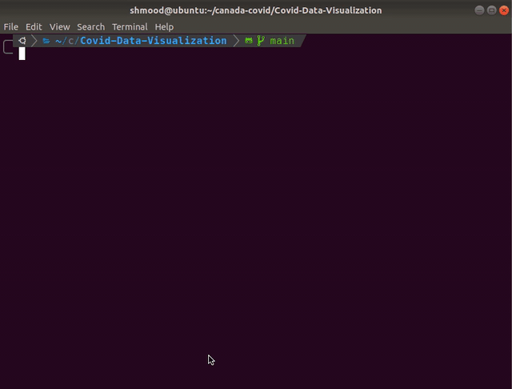
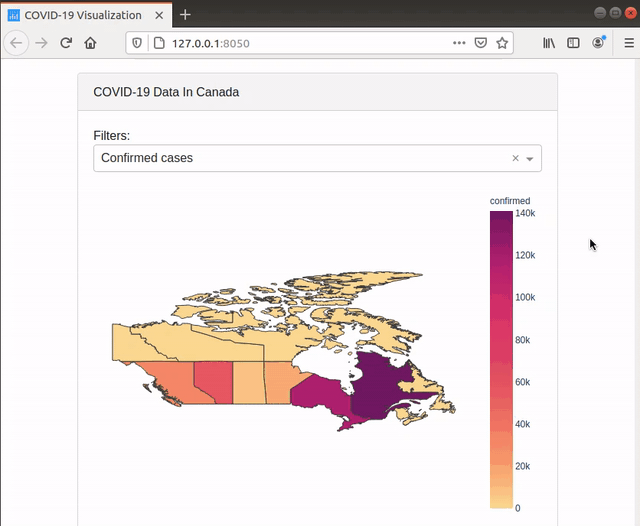
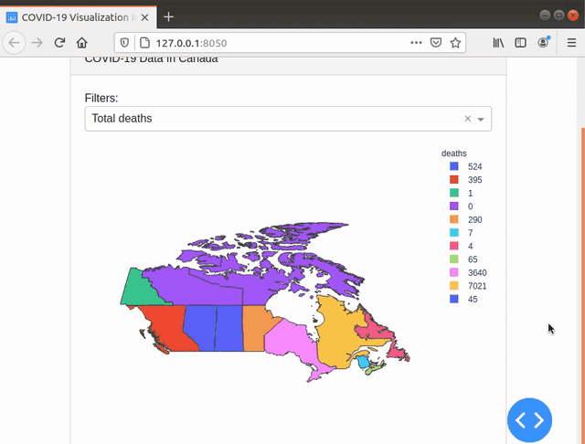
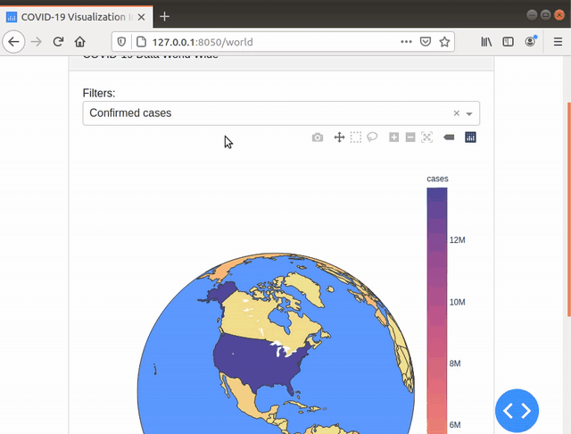

# Covid-Data-Visualization
This repository was created to so a visualization of how the on-going pandemic is effecting Canada and the rest of the world. Special thanks to Dyllon for providing the idea for this project.

# How It Was Made
This project was made using Python-Flask, Dash and Plotly. All of the COVID-19 data for Canada is pulled from an API which can be found [here](https://covid-api.com/). All COVID-19 data for the rest of the world is pulled from [this](https://documenter.getpostman.com/view/11144369/Szf6Z9B3?version=latest) API. Specifically, the API for Canada uses the `/reports` endpoint with the ISO of `CAN`. For the world API, it pulls data from the `/v2/countries` endpoint. The program periodically pulls from these APIs every 5 minutes. To attempt with helping the applications speed, the application uses Flask-Caching to cache the APIs results as well as the GeoJSON data being read from `canada.geojson`. As mentioned, each of the APIs data is cached for 5 minutes, where the GeoJSON data is cached for 30 minutes.

# Running
In order to run this application it's best to create a virtual environment on your machine to ensure it won't interfere with anything else you may have installed. To do this, you must first create a virtual environment on your machine by running:
* `python3 -m venv covid-visualization`

To activate the virtual environment, run the following:
* `source covid-visualization/bin/activate`

To ensure the virtual environment is correctly setup you can run `which python3` to determine what Python interpreter your system is using. It should return something similar to:
* `/Users/username/covid-visualization/bin/python3`

Once the virtual environment is setup, move to the virtual environments directory and clone this reposity into it, then move to the repository.
* `cd covid-visualization/`
* `cd Covid-Data-Visualization/`

Once in the repositories folder, intsall the required packaged needed using pip.
* `pip3 install -r requirements.txt`

Once the packages are installed, run `python3 covid-visualization.py` and direct yourself to `http://localhost:8050/` to view the interactive graphs.

Note: Once done using the application, you can disable the virtual environment you created by running `deactivate`.

# How It Looks

Here's how the map will look when initially visiting `http://localhost:8050/`:

You can also filter the graph of Canada by:
* Confirmed cases
* Active cases
* Total deaths
* Recovered

After selecting a filter a new map will be rendered with the appropriate data, this should only take a few seconds to render.

The following screenshots is what's shown when a user clicks on the `World` link.

This map can also be filtered by numerous different options:
* Confirmed cases
* Active cases
* Active cases per million
* Cases today
* Cases per million
* Tests
* Tests per million
* Critical cases
* Critical per million
* Deaths
* Deaths today
* Deaths per million
* Recovered
* Recovered today
* Recovered per million

Once clicking on one of the filters, the world map will be updated with the appropriate data.

The reason the world map has more filters than the Canadian map is because of the API being used. The API being used for the world map provides way more detailed information than the API being used for Canada.
